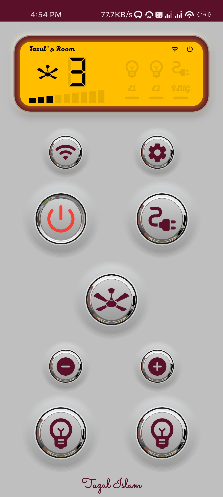
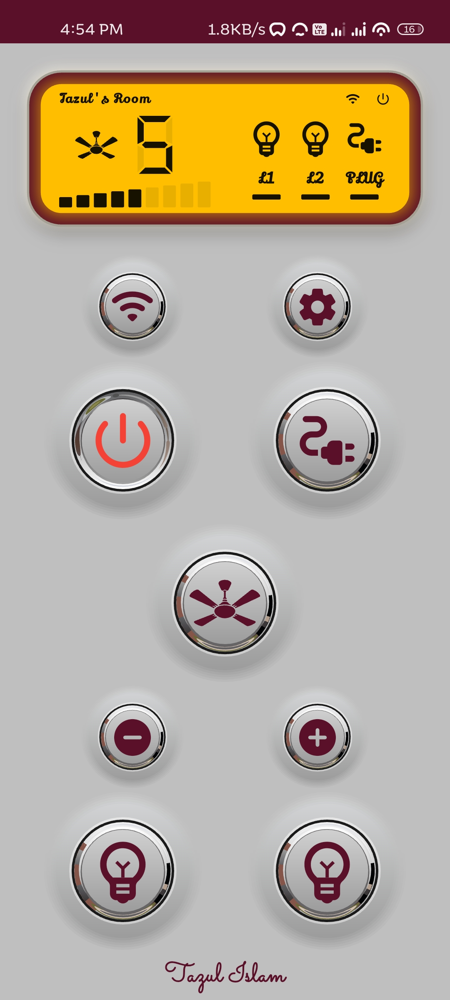
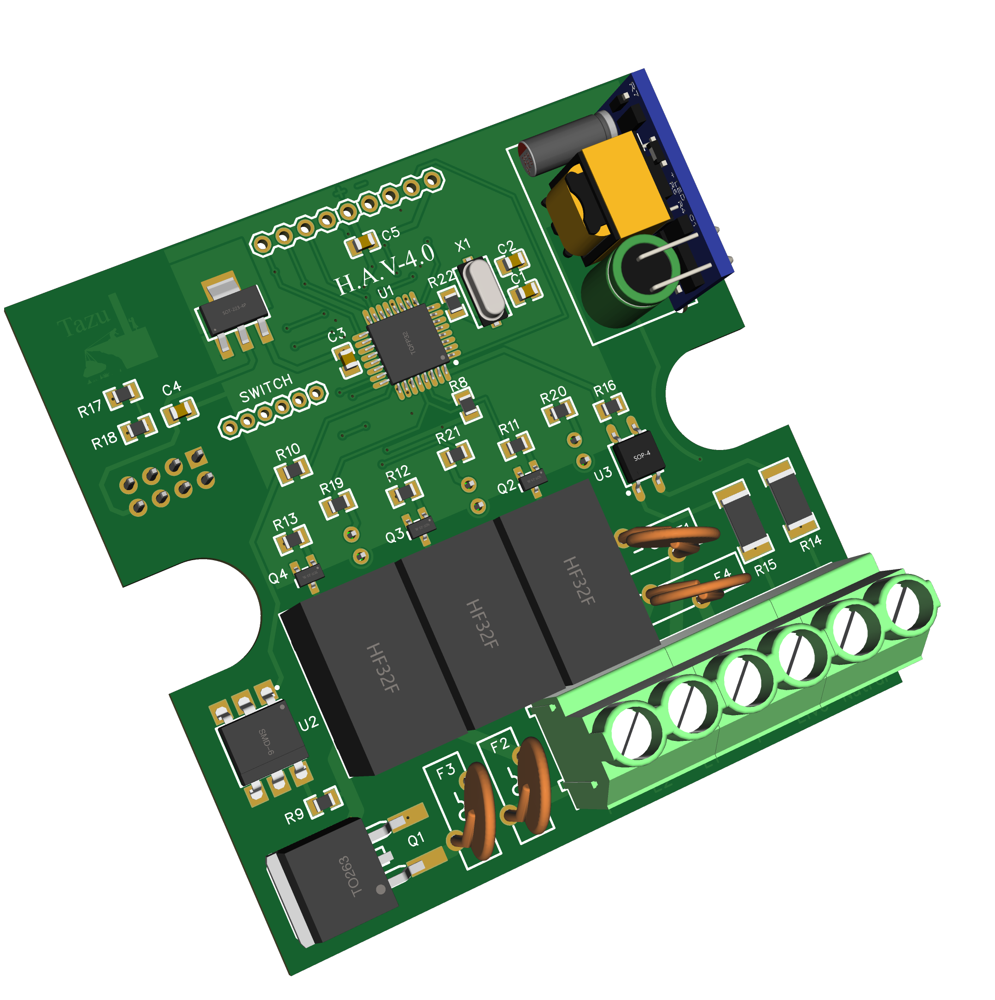
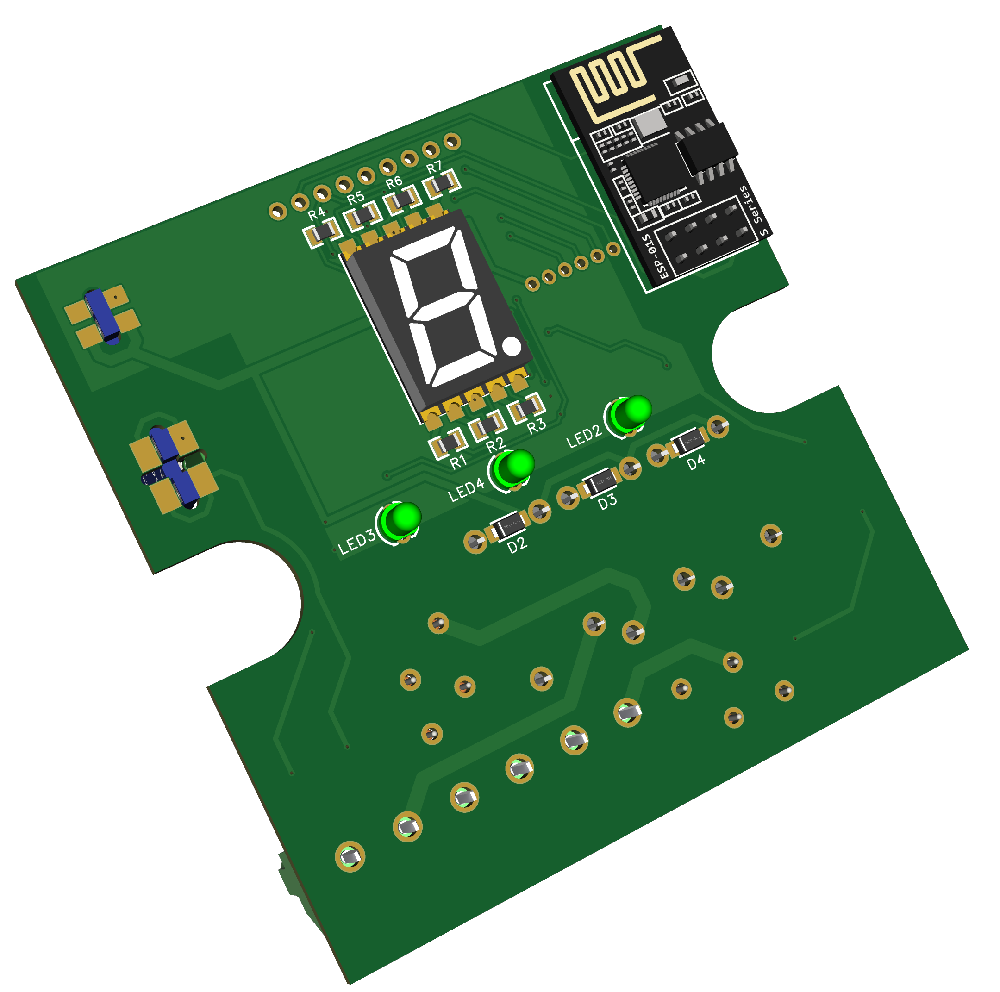
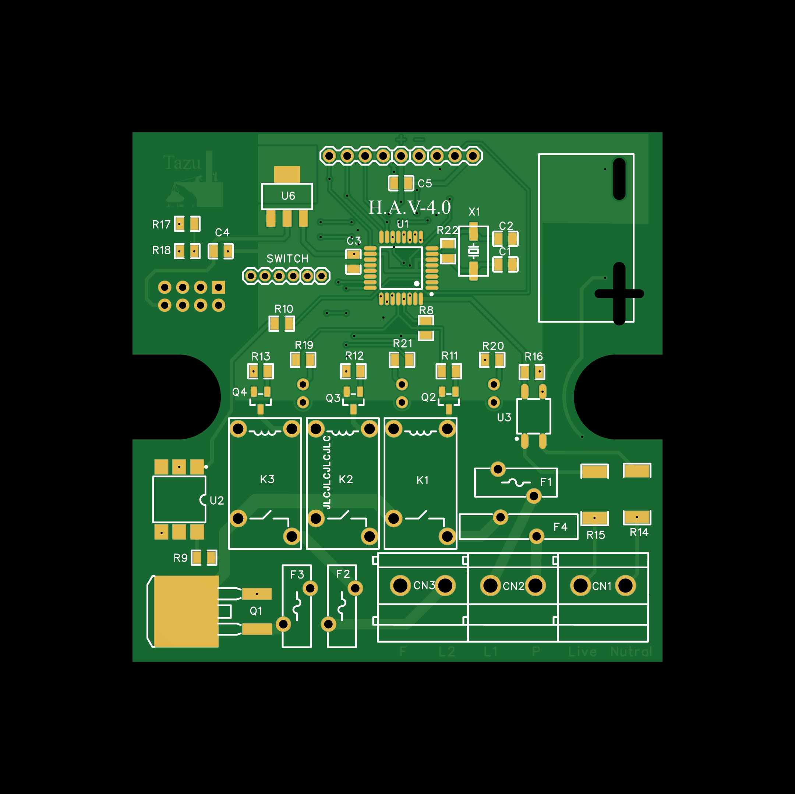
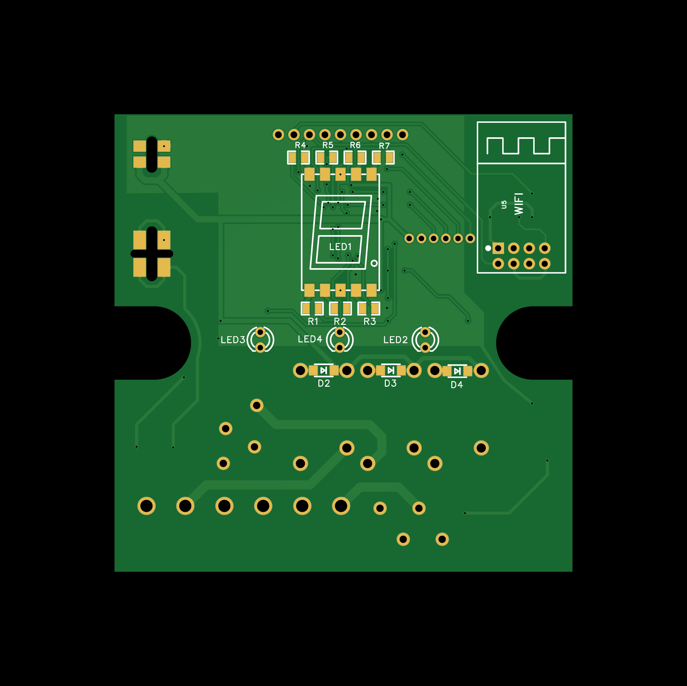
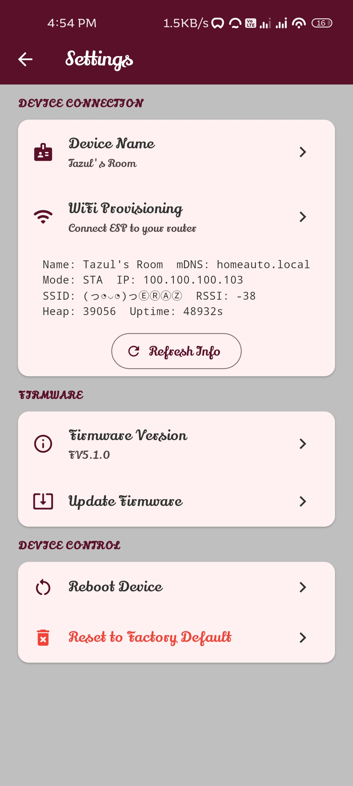
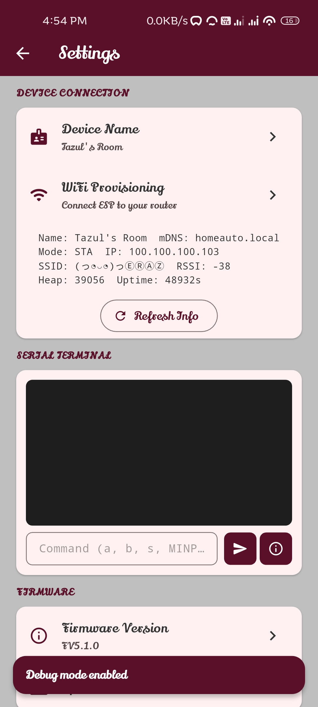

# 🏠 Smart Home Automation System V5.1.0

A complete, end-to-end IoT home automation project featuring an **ATmega8A** real-time AC controller, an **ESP-01S** Wi-Fi gateway, and a cross-platform **Flutter** mobile application.

  
  &nbsp; &nbsp; &nbsp; &nbsp;
  

## 🌟 Overview
This repository contains the complete source code, hardware schematics, and mobile app for a custom-built smart home controller. The system is designed to provide robust, real-time control over high-voltage AC appliances with seamless Wi-Fi connectivity and a beautiful mobile user interface.

## ✨ Key Features
* **Phase-Angle Triac Dimming**: Deterministic, hardware-timer-based AC fan speed control (levels 1-9).
* **Zero-Cross Synchronization**: Uses hardware interrupts for precise AC wave timing and noise recovery.
* **REST API & WebSockets**: Instantaneous bi-directional communication between the app and the hardware.
* **Wi-Fi Provisioning**: Captive portal fallback for easy network configuration straight from the app.
* **Over-The-Air (OTA) Updates**: Flash the ESP-01S directly from the mobile app.
* **Infrared (IR) Fallback**: SIRC-12 remote control decoding for physical TV remote support.
* **State Persistence**: ATmega8A EEPROM retains the exact device state (power, fan speed, lights) across power outages.

## 📸 Hardware Gallery

### 3D Renders

  
  

### PCB Layout

  
  

### App Screens

  
  

## 📂 Repository Structure
* **[`/Firmware/atmega8a_firmware/`](Firmware/atmega8a_firmware/)**: Real-time C++ firmware for the ATmega8A (Triac dimming, IR, Zero-cross).
* **[`/Firmware/esp01s_firmware/`](Firmware/esp01s_firmware/)**: C++ firmware for the ESP8266 (REST API, WebSocket server, mDNS, OTA).
* **[`/Home_App/`](Home_App/)**: Flutter mobile application (UI, Settings, API client, WebSocket listener).
* **[`/Pictures_PCB_Schematics/`](Pictures_PCB_Schematics/)**: Hardware schematics, PCB layouts, and 3D renders.

## 🛠️ Hardware Configuration
The custom PCB centers around an ATmega8A microcontroller and an ESP-01S module as a gateway.
* **Outputs**: 1x Fan (Triac dimming via PD3), 2x Lights (Relays on PC0, PC1), 1x Socket (Relay on PC5).
* **Inputs**: Zero-Cross Detector (INT0/PD2), IR Receiver (PB2).

### Schematic

## 🚀 Getting Started

1. **Flash the ATmega8A**:
   Use an ISP programmer to flash `atmega8a_firmware.ino` to the ATmega8A (Requires 16 MHz external crystal fuse bits).
2. **Flash the ESP-01S**:
   Flash `esp01s_firmware.ino` using an FTDI adapter. It will host a `HomeAuto_XXXX` Wi-Fi network initially.
3. **Run the Flutter App**:
  Navigate to `/Home_App`, run `flutter pub get`, and `flutter run` to launch the app on your mobile device.

> **Note**: For a deep dive into the system architecture, serial communication protocol, and REST API, please see [DOCUMENTATION.md](DOCUMENTATION.md).

---
*Designed & Developed by Md. Omar Faruk Tazul Islam*
